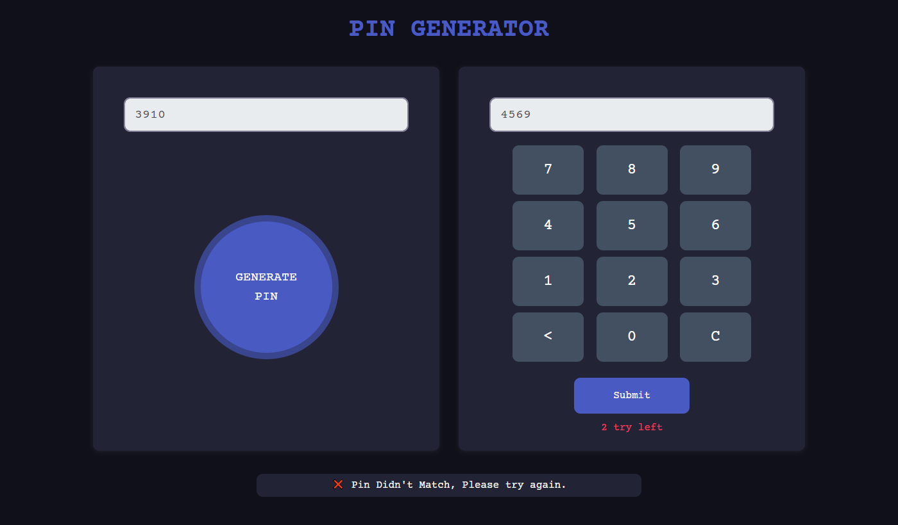
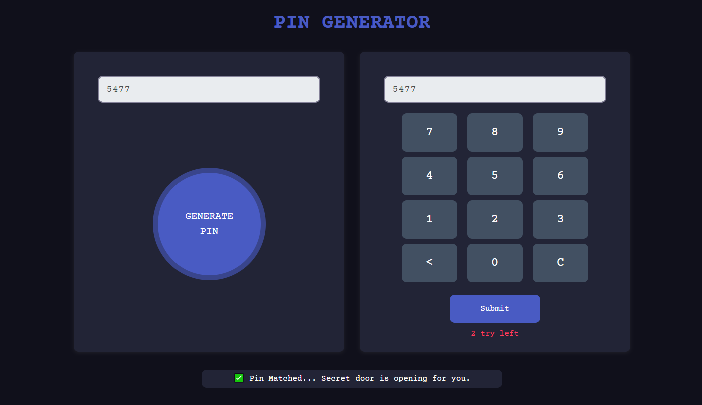
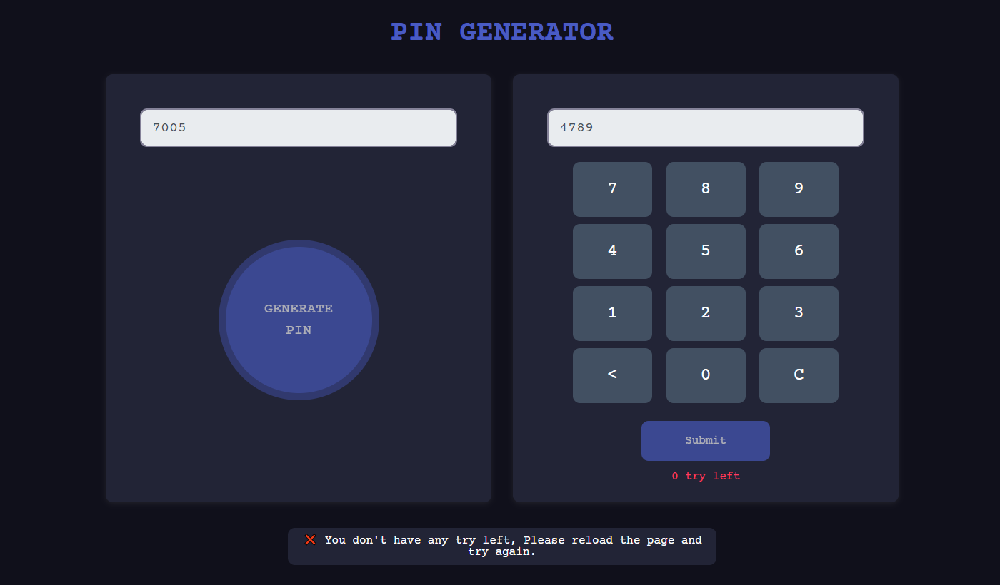

# Pin Matcher
## ([Live Preview](https://tayab-pabel.github.io/pin-matcher/))
## Features
   - It's a vanilla js project.
   - Generate auto pin and checking the pin with user input is correct or not.
   - After three tries generate pin and submit button will be disabled.
   - Responsive layout.
## Technology
   - HTML
   - CSS
   - Bootstrap
   - Javascript
## Tools
   - Visual Studio Code
   - Github
   - Chrome Dev Tools
## User Interface

